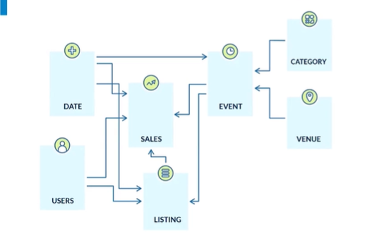

# Curso de AWS Redshift para Manejo de Big Data  
## 1. Que es un DataWarehouse:  
Es una base de datos muy grande con muchas fuentes de datos. Es una estructura Analítica que consolida toda la información de distintas fuentes.  

### ¿Como los cargo?
Para llevarse estos datos a un datawarehouse hacemos un ETL. Extraigo los datos de todas las fuentes, los transformo y luego los cargos dentro del DWH.  

### Arquitectura del DWH:
En general la industria cuenta con una arquitectura similar, usando el modelo dimensional. Teniendo dimensiones y una tabla de hechos con todas las buenas prácticas.  

### Modelo del curso:
El modelo que se trabajará a través de este repo, es un modelo de ventas relacionado de la siguiente forma:  
  

## 2. Bases de datos columnares y arquitectura orientada a optimización.  
Estas son bases de datos optimizadas para recuperación rápida de columnas enteras de datos. Existen otro tipo de arquitecturas basadas en filas, estas son más OLTP, están orientadas a lectura y escritura rápida basadas en filas. 

Lo que cambia en cada uno, es el bloque de datos. En filas, se va guardando a un bloque de datos en disco duro. Esto tiene sentido ya que busca el registro más rápido, por ejemplo al realizar una compra, los puntos que se van a actualizar correponde a un id de cliente. Estos soportan todas las operaciones y transacciones de la compañía.  

El problema es que normalmente cada bloque pesa 32 kilobytes. Para este tipo de tablas, si yo quisiera una consulta a una tabla de 10 columnas, y realmente requiero 3, internamente el OLTP lee las 7 restantes.